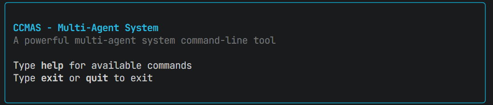

# CCMAS Python CLI

多智能体系统 Python CLI - 学习参考项目。

## 项目状态：持续开发中

本项目是对多智能体系统核心逻辑的 **Python 实现**，用于**学习和参考目的**。项目**仍在积极开发中**，暂未达到生产就绪状态。

**本项目参考了 Claude Code 源码，复刻了其多智能体系统的核心机制。**

### 开发状态

| 功能 | 状态 | 说明 |
|------|------|------|
| 核心 Agent 循环 | 可用 | 主要交互流程 |
| Skill 系统 | 可用 | 安装和使用 skills |
| Memory 系统 | 可用 | 持久化记忆 |
| 内置 Agent | 可用 | General purpose、Plan、Verification 等 |
| Tmux Teammate | 开发中 | 真正的并行 Agent |
| AutoCompact | 可用 | 对话压缩 |
| Token Budget | 可用 | +500k 语法 |
| MCP 工具 | 未实现 | 非当前优先级 |

## 项目概述

CCMAS (Multi-Agent System) Python CLI 是对多智能体系统核心逻辑的 Python 实现。

**本项目参考了 Claude Code 源码，复刻了其多智能体系统的核心机制。**

兼容 OpenAI 格式的模型（vLLM、Ollama、MiniMax、DeepSeek等）。

## 启动界面



### 核心功能

- **MAS 工作逻辑** - 五种子代理模式（Fork、Named、In-process、Tmux、Remote）
- **AutoCompact 自动压缩** - 对话过长时自动生成摘要，释放上下文空间
- **Token Budget 预算控制** - 支持 +500k 语法指定执行预算，自动继续执行
- **Memory 系统** - MEMORY.md 索引系统，自动管理用户/项目记忆
- **权限冒泡机制** - permission\_mode='bubble' 权限委托
- **工具系统** - Bash、Read、Write、Edit、Glob、Grep、Agent
- **异步支持** - 基于 asyncio
- **交互式 CLI** - 现代化命令行交互方式
- **Skill 系统** - 安装并通过 /skill-name 调用预设技能
- **Tmux Teammate** - 真正的多终端并行 Agent
- **Hooks 系统** - PreTool/PostTool 钩子支持
- **错误恢复** - 自动重试、断点恢复
- **OpenClaw 集成** - 通过 state.json 支持外部任务协调

## 安装

```bash
pip install -e .
```

## 快速开始

### 首次使用

```bash
ccmas --setup
ccmas
```

### 基本用法

```bash
ccmas
ccmas "写一个斐波那契函数"
ccmas "+500k 实现一个Web服务器"
ccmas --ollama --model llama3
ccmas --api-base https://api.minimax.chat/v1 --api-key YOUR_KEY --model MiniMax-M2.7
```

## CLI 参数

| 参数                    | 说明           |
| --------------------- | ------------ |
| --setup               | 运行设置向导       |
| --reset               | 重置配置         |
| --workspace, -w       | 工作目录         |
| --model, -m           | 模型名称         |
| --api-base, -b        | API 端点        |
| --api-key, -k         | API 密钥        |
| --ollama              | 使用 Ollama   |
| --vllm                | 使用 vLLM     |
| --temperature, -t     | 采样温度         |
| --permission-mode, -p | 权限模式         |
| --continue            | 继续上次会话       |
| --load-session        | 加载历史会话       |
| --no-memory           | 禁用 Memory    |
| --verbose, -v         | 详细输出         |
| --version             | 显示版本         |

## Skill 命令

```bash
# 从 GitHub 安装 skill
ccmas skill install user/repo
ccmas skill install user/repo/skill-name
ccmas skill install https://github.com/user/repo/blob/main/skills/my-skill/SKILL.md

# 从本地路径安装
ccmas skill install /path/to/local/skill

# 列出已安装的 skills
ccmas skill list

# 显示 skill 信息
ccmas skill info <name>

# 更新 skill
ccmas skill update <name>

# 卸载 skill
ccmas skill uninstall <name>
```

Skills 安装到 `~/.ccmas/skills/<skill-name>/SKILL.md`。

## 核心功能

### AutoCompact 自动压缩

当对话上下文接近 token 限制时，CCMAS 会：

1. 调用 LLM 生成对话摘要
2. 保留最近消息和关键上下文
3. 插入压缩边界标记
4. 继续对话

### Token Budget 预算控制

在任务描述前添加 `+500k`（或 `use 2M tokens`）：

```bash
ccmas "+500k 重构整个用户认证模块"
```

系统会：

- 追踪 token 使用量
- 预算耗尽前发送继续消息
- 检测收益递减并正确停止

### Memory 系统

CCMAS 提供持久化 Memory 系统：

```
~/.ccmas/
├── memory/
│   └── MEMORY.md        # 用户级记忆索引
├── project/
│   └── {hash}/
│       └── MEMORY.md    # 项目级记忆索引
└── sessions/            # 会话历史
```

**保存 Memory**：AI 自动将重要信息保存到 Memory 文件：

1. 写入 `~/.ccmas/memory/xxx.md`
2. 更新 `MEMORY.md` 索引

**Memory 类型**：

- `user` - 用户角色、偏好、知识
- `feedback` - 用户反馈和指导
- `project` - 项目特定信息
- `reference` - 外部系统参考

### Skill 系统

Skills 是可复用的指令集，兼容 Claude Code 的 skill 格式。

**SKILL.md 格式**：

```yaml
---
name: code-review
description: 执行全面的代码审查
when_to_use: 当你需要审查代码变更时
allowed-tools: [Read, Grep, Bash]
model: opus
effort: high
context: fork
---

# Code Review

## Instructions
1. 获取变更
2. 审查 bug
3. 检查风格
```

使用 `/code-review` 调用 skill。

### Tmux Teammate

通过 tmux 实现真正的并行 Agent：

```python
from ccmas.teammate.tmux import TmuxWorker

worker = TmuxWorker(name="researcher")
await worker.start()
await worker.send_message("研究 X 技术")
result = await worker.recv_response()
```

### CLAUDE.md 多级发现

在项目目录树的任意位置创建 `CLAUDE.md`：

```
project/
├── CLAUDE.md              # 项目根级
├── src/
│   ├── CLAUDE.md          # src 目录级
│   └── components/
│       └── CLAUDE.md      # components 目录级
```

系统从浅到深按深度加载所有文件。

## 权限模式

| 模式              | 说明           |
| ---------------- | ------------ |
| default          | 标准权限处理       |
| acceptEdits      | 自动接受编辑       |
| bypassPermissions | 跳过权限检查      |
| bubble           | 权限冒泡到父代理    |
| plan             | 规划模式         |
| auto             | 自动模式         |

## 项目结构

```
ccmas-python-cli/
├── src/ccmas/
│   ├── agent/              # Agent 系统
│   │   ├── run_agent.py    # Agent 执行引擎
│   │   ├── fork_subagent.py # Fork 子代理
│   │   ├── definition.py   # Agent 定义
│   │   ├── agent_tool.py   # Agent 工具
│   │   └── builtin/        # 内置 Agent
│   ├── cli/                # CLI 入口
│   │   ├── main.py         # 主入口
│   │   ├── commands.py     # 命令处理
│   │   ├── config.py       # 配置管理
│   │   └── ui.py           # UI 界面
│   ├── context/            # 上下文隔离
│   │   ├── agent_context.py
│   │   ├── teammate_context.py
│   │   └── subagent_context.py
│   ├── coordinator/        # 协调模式
│   ├── hooks/              # Hooks 系统
│   │   ├── manager.py      # Hook 管理器
│   │   └── integration.py  # Hook 集成
│   ├── llm/                # LLM 客户端
│   │   ├── client.py       # 通用客户端
│   │   ├── openai.py       # OpenAI 兼容
│   │   ├── ollama.py       # Ollama
│   │   └── vllm.py         # vLLM
│   ├── memory/             # Memory 系统
│   │   ├── loader.py       # Memory 加载器
│   │   ├── state_manager.py # 状态恢复
│   │   ├── template.py     # Memory 模板
│   │   ├── session.py      # 会话管理
│   │   ├── summarizer.py   # 摘要生成
│   │   └── types.py        # 类型定义
│   ├── permission/         # 权限系统
│   │   ├── checker.py      # 权限检查
│   │   ├── mode.py         # 权限模式
│   │   └── bubble.py       # 权限冒泡
│   ├── prompt/             # 系统提示词
│   │   ├── system.py       # 系统提示词
│   │   ├── tools.py        # 工具提示词
│   │   └── agent.py        # Agent 提示词
│   ├── query/              # 查询循环
│   │   ├── loop.py         # 主循环
│   │   ├── compact.py      # 自动压缩
│   │   ├── token_budget.py # 预算控制
│   │   ├── summarizer.py   # 摘要器
│   │   ├── tool_executor.py # 工具执行器
│   │   └── message_builder.py # 消息构建器
│   ├── skill/              # Skill 系统
│   │   ├── manager.py      # Skill 管理器
│   │   ├── tool.py        # Skill 工具
│   │   └── commands.py     # Skill 命令
│   ├── teammate/           # Teammate 系统
│   │   ├── tmux.py        # Tmux 实现
│   │   ├── in_process.py  # 进程内
│   │   ├── mailbox.py     # 消息队列
│   │   ├── spawn.py       # 生成管理器
│   │   └── send_message.py # 消息发送器
│   ├── tool/               # 工具系统
│   │   ├── base.py        # 工具基类
│   │   ├── registry.py    # 工具注册表
│   │   └── builtin/       # 内置工具
│   │       ├── bash.py
│   │       ├── read.py
│   │       ├── write.py
│   │       ├── edit.py
│   │       ├── glob.py
│   │       └── grep.py
│   └── types/             # 类型定义
│       ├── agent.py
│       ├── message.py
│       └── tool.py
├── docs/                  # 文档
└── pyproject.toml
```

## 配置

配置文件位于：`~/.ccmas/config.json`

### OpenAI 兼容 API 示例

```bash
# MiniMax
ccmas --api-base https://api.minimax.chat/v1 --api-key YOUR_KEY --model MiniMax-text-01

# DeepSeek
ccmas --api-base https://api.deepseek.com/v1 --api-key YOUR_KEY --model deepseek-chat

# 本地模型
ccmas --api-base http://localhost:8000/v1 --model llama3
```

## 开发

```bash
# 安装开发依赖
pip install -e ".[dev]"

# 代码检查
ruff check src/

# 类型检查
mypy src/
```

## 功能对比

| 功能            | 参考实现 | CCMAS |
| ------------- | ---- | ----- |
| AutoCompact   | Yes  | Yes   |
| Token Budget  | Yes  | Yes   |
| Memory 系统     | Yes  | Yes   |
| Skill 系统      | Yes  | Yes   |
| Tmux Teammate | Yes  | Yes   |
| Hooks 系统      | Yes  | Yes   |
| 错误恢复          | Yes  | Yes   |
| CLAUDE.md 多级  | Yes  | Yes   |
| MCP 工具        | Yes  | No    |

## OpenClaw 集成

CCMAS 支持通过 `state.json` 与外部任务协调工具（如 OpenClaw）集成。

使用 `--task-id` 运行时，CCMAS 会在 `~/.ccmas/projects/{hash}/state.json` 创建任务状态文件：

```json
{
  "task_id": "module_auth_v1",
  "status": "running",
  "summary": "",
  "errors": [],
  "started_at": "2026-04-08T00:10:00Z",
  "updated_at": "2026-04-08T00:10:00Z"
}
```

外部工具可以通过轮询此文件监控 CCMAS 任务执行状态。

## 许可证

MIT License
